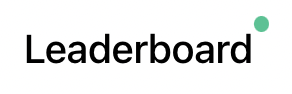

# Leaderboard

A web app displaying real-time leaderboard, powered by SocketIO.

## Features

### 1. Real-time updates on players’ status

Powered by socket.io with context API, updates show up real-time across browsers connected to socket.

#### Functionalities

- Add Player(s)
<p align="center">

</p>

- Delete Player(s)
<p align="center">

</p>

### 2. Dynamic page pagination

<p align="center">

</p>

### 3. Dynamic sorting display

The order of players can be shown **alphabetically** according to their names, or in **ranks** (ascending/descending numerical order) according to their scores.

<p align="center">

</p>

### 4. Online/Offline signal for websocket connection

On successful connection to websocket, green light will be shown

<p align="center">

</p>

On unsuccessful connection or disconnectikon to websocket, red light will be shown

<p align="center">

</p>

## Context API

### General Context:

Managing players:

```typescript
interface GeneralState {
  players: Player[];
  setPlayers: React.Dispatch<React.SetStateAction<Player[]>>;
}
```

Leaderboard number for reference to [socket server](https://github.com/rachelhox/leaderboard-backend):

```typescript
interface GeneralState {
  board: string;
}
```

### Socket Context:

Global `socket` variable to manage socket events in this app:

```typescript
interface SocketContextState {
  socket: any;
}
```

## Getting Started

First, run the development server:

```bash
npm run dev
```

Open [http://localhost:3000](http://localhost:3000) with your browser to see the result.
